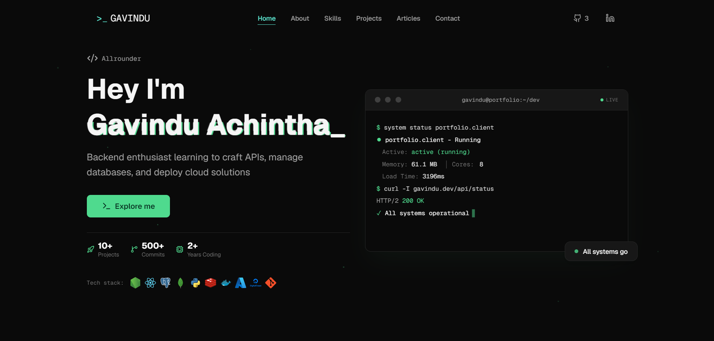

<div align="center">



<br/>
<br/>

<!-- Animated title via typing SVG -->

[](https://git.io/typing-svg)

<br/>

<!-- Status badges -->


</div>

---

```bash
$ whoami
● gavindu.achintha — Backend Engineer · Robotics Enthusiast · Undergrad
   Status: active (running)
   Projects: 10+  |  Commits: 500+  |  Years Coding: 2+
$ echo "Welcome to my portfolio"
> Welcome to my portfolio ▊
```

---

## ✦ Overview

A personal developer portfolio built with **Next.js 16**, **React 19**, and **TypeScript** — designed to feel like a living terminal. Smooth animations via **Framer Motion**, 3D elements powered by **React Three Fiber**, and a contact system wired up through **Resend**.

Every section mirrors a real dev workflow: glitch-text headers, animated skill layers, a live-typing terminal hero, and GitHub-integrated project cards.

---

## ⚡ Tech Stack

<div align="center">

| Layer              | Technologies                                                  |
| ------------------ | ------------------------------------------------------------- |
| **Frontend**       | React · Next.js · TypeScript · Tailwind CSS                   |
| **Animation**      | Framer Motion · React Three Fiber / Drei                      |
| **Backend**        | Node.js · Go · Express.js · FastAPI                           |
| **Data**           | PostgreSQL · MongoDB · Redis · Supabase                       |
| **Cloud & DevOps** | Docker · GitHub Actions · AWS · Azure · DigitalOcean · Vercel |
| **AI / ML**        | Python · OpenCV · YOLO · TensorFlow · Edge Impulse            |
| **Embedded**       | C · C++ · Arduino · ESP32 · Raspberry Pi · ROS · MQTT         |

</div>

---

## 🗂️ Portfolio Sections

```
📁 portfolio/
├── 🏠  Hero          — Live-typing terminal, animated stats, tech stack
├── 👤  About         — Terminal-style profile with areas of focus
├── 🛠️  Skills        — Layered skill groups across 6 domains
├── 🚀  Projects      — GitHub-linked project cards with tags & previews
├── 📝  Articles      — Published writing (Medium, Dev.to, Hashnode)
└── 📬  Contact       — Email form powered by Resend API
```

---

## 🚀 Featured Projects

### [Looma — Personal AI Email Summarizer](https://github.com/Gavinduachintha/Looma)

AI-powered email management with Gmail integration, real-time analytics, and smart calendar sync.  
`React` `Node.js` `PostgreSQL` `Gmail API` `AI`

### [Shorty — URL Shortener](https://github.com/Gavinduachintha/Shorty)

Modern URL shortener with analytics tracking, custom branding, and a beautiful responsive UI.  
`Next.js` `Supabase`

### [PetConnect — Lost Pet Reunification System](https://github.com/Gavinduachintha/PetReunification)

QR code-based system to reunite lost pets with their owners via a mobile-friendly pet profile page.  
`React` `Supabase` `Tailwind CSS` `Vite`

---

## 🛠️ Getting Started

```bash
# 1. Clone the repo
git clone https://github.com/Gavinduachintha/portfolio.git
cd portfolio

# 2. Install dependencies
npm install

# 3. Set up environment variables
cp .env.local.example .env.local
# Fill in your RESEND_API_KEY and other keys

# 4. Start the dev server
npm run dev
```

Then open [http://localhost:3000](http://localhost:3000).

---

## 🔑 Environment Variables

Create a `.env.local` file in the root with:

```env
RESEND_API_KEY=your_resend_api_key
```

> The contact form uses [Resend](https://resend.com) for email delivery.

---

## 📜 Available Scripts

```bash
npm run dev      # Start development server
npm run build    # Build for production
npm run start    # Start production server
npm run lint     # Run ESLint
```

---

## 📁 Project Structure

```
portfolio/
├── app/
│   ├── api/
│   │   ├── email/        # Contact form email route (Resend)
│   │   └── github/       # GitHub stats API route
│   ├── components/       # All UI components
│   │   ├── ui/           # Reusable card components
│   │   ├── hero.tsx
│   │   ├── aboutme.tsx
│   │   ├── skills.tsx
│   │   ├── projectgrid.tsx
│   │   ├── articles.tsx
│   │   └── contact.tsx
│   ├── config/
│   │   └── site.config.ts  # Name, nav, social links
│   ├── data/
│   │   ├── projectlist.ts
│   │   ├── skills.ts
│   │   └── articles.ts
│   ├── lib/
│   │   ├── actions.ts
│   │   └── theme.ts
│   ├── layout.tsx
│   └── page.tsx
├── public/
│   └── images/           # Profile photo, project screenshots
├── next.config.ts
└── package.json
```

---

## 🌐 Connect

<div align="center">

[](https://github.com/Gavinduachintha)
[](https://www.linkedin.com/in/gavindu-achintha/)
[](https://x.com/P911Stum)

</div>

---

<div align="center">

```
$ curl -I gavindu.dev/api/status
HTTP/2 200 OK
✓ All systems operational  ▊
```

<sub>Built with ❤️ by <strong>Gavindu Achintha</strong></sub>

</div>
